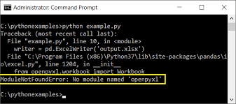
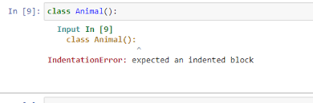
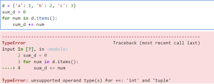
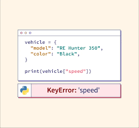
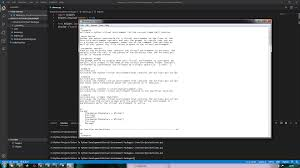
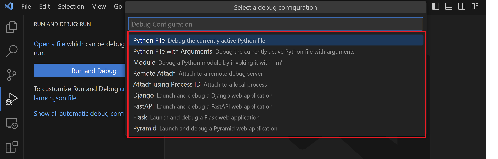

# 🐍 Python Troubleshooting Guide  
**Your handbook to fixing common Python errors**  

  
  

## 📌 Table of Contents  
1. [Installation Issues](#1-installation-issues)  
2. [Syntax Errors](#2-syntax-errors)  
3. [Runtime Errors](#3-runtime-errors)  
4. [Data Handling](#4-data-handling)  
5. [Environment Setup](#5-environment-setup)  
6. [Debugging Tips](#6-debugging-tips)  
7. [Contributing](#7-contributing)  


## 1. Installation Issues  
### 🔧 ModuleNotFoundError  
**What you see:**  
  
  

**Why it happens:**  
Python can't find the package because:  
- It's not installed  
- You're using the wrong Python version  
- The package name is misspelt  

**How to fix:**  
```bash
# Install the package
pip install numpy

# Verify installation
python -c "import numpy; print(numpy.__version__)"
```

**Prevention Tip:**  
```bash
# Always use requirements.txt
pip freeze > requirements.txt
```


## 2. Syntax Errors  
### 📏 IndentationError  
**Visual example:**  
  


**Common causes:**  
- Mixing tabs and spaces  
- Missing indentation after `def`/`if`/`for`  

**Solution:**  
```python
# Before (Error)
def greet():
print("Hello")  # ← Missing indent

# After (Fixed)
def greet():
    print("Hello")  # ← 4 spaces
```

**Pro Tip:** Configure your editor to:  
1. Show invisible characters  
2. Auto-convert tabs to spaces  


## 3. Runtime Errors  
### ➕ TypeError  
**Error screenshot:**  
  

**Broken code:**  
```python
age = 25
print("Age: " + age)  # Can't add str + int
```

**3 Ways to fix:**  
```python
# 1. Convert manually
print("Age: " + str(age))

# 2. Use f-strings (Python 3.6+)
print(f"Age: {age}")

# 3. Use format()
print("Age: {}".format(age))
```


## 4. Data Handling  
### 🗃️ KeyError in Dictionaries  
**Error example:**  
  

**Problem code:**  
```python
user = {'name': 'Alice'}
print(user['age'])  # ← Key doesn't exist
```

**Safe access methods:**  
```python
# 1. get() with default
print(user.get('age', 'N/A'))  # Returns 'N/A' if missing

# 2. Check first
if 'age' in user:
    print(user['age'])
```


## 5. Environment Setup  
### 🌐 Virtual Environments  
**Terminal demo:**  
  

**Step-by-step:**  
```bash
# Create environment
python -m venv .venv

# Activate (Windows)
.venv\Scripts\activate

# Activate (Mac/Linux)
source .venv/bin/activate
```

**Why use venv?**  
- Prevents package conflicts  
- Makes projects reproducible  


## 6. Debugging Tips  
### 🐞 VS Code Debugger  
**Debug view screenshot:**  
  

**How to use:**  
1. Set breakpoints (click left gutter)  
2. Press F5 to start debugging  
3. Inspect variables in the sidebar  

**Common debug commands:**  
- **Step Over (F10)**: Execute current line  
- **Step Into (F11)**: Go into function calls  


## 7. Contributing  
**Found a missing error?**  
1. Fork this repository  
2. Add your example:  
   ```markdown
   ### New Error Name  
   **Screenshot:**  
     
   **Solution:**  
   ```python
   # Your fix here
   ```
   ```
3. Submit a pull request  

📬 **Contact:** kayodeprosper0987@gmail.com
